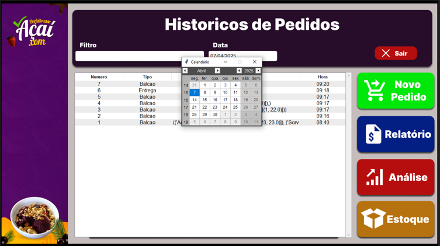
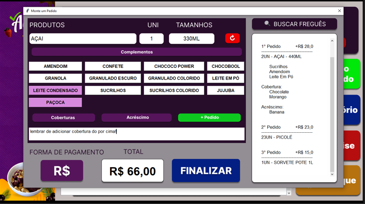
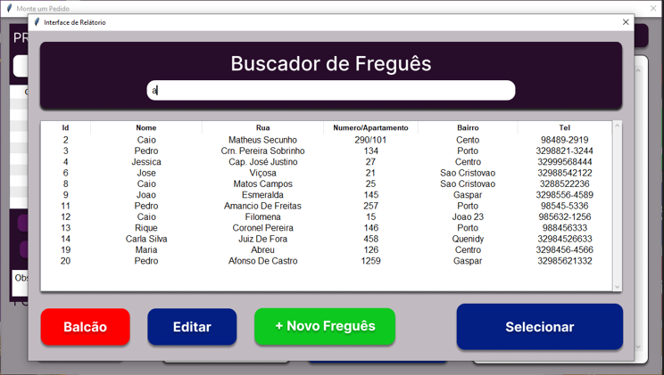
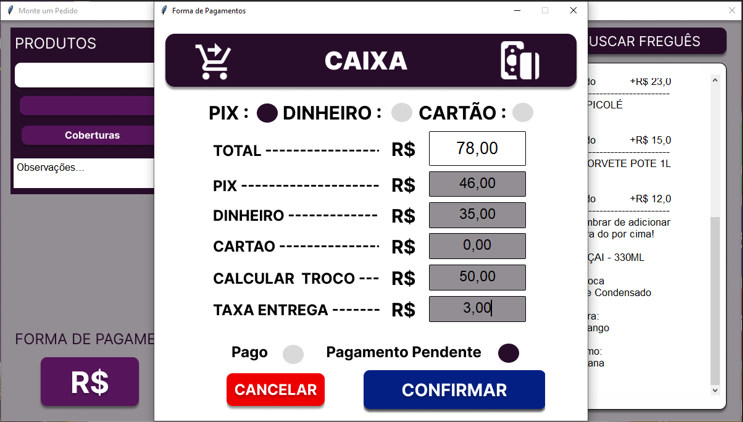
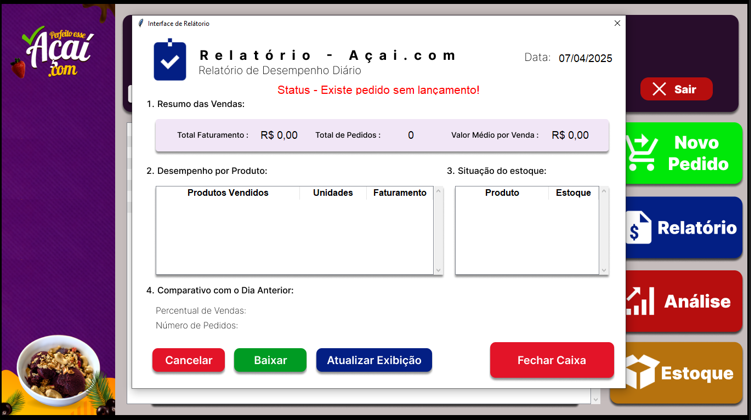
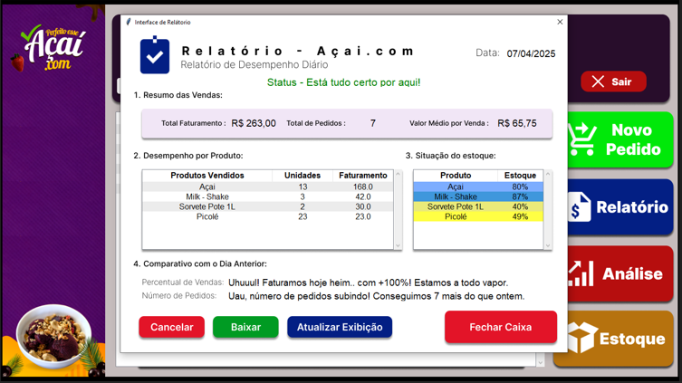
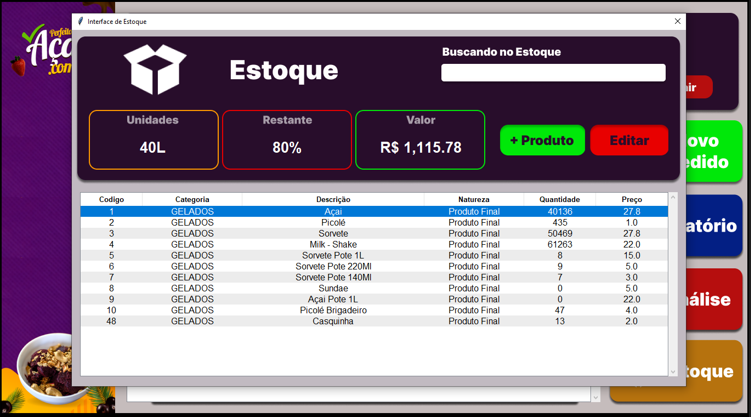

## 🍧 Sistema de Gestão para Loja de Açaí

Este projeto foi desenvolvido com o objetivo de ajudar um amigo que possui uma loja de açaí e enfrentava dificuldades para gerenciar pedidos, controlar o estoque e acompanhar os ganhos da loja — tudo era feito manualmente, em cadernos, o que causava desorganização e frustração.

Pensando nisso, criei esta ferramenta para digitalizar e simplificar o dia a dia da loja. O sistema permite:

- Montagem rápida de pedidos;
- Cálculo automático de totais e formas de pagamento;
- Controle de estoque;
- Acompanhamento de relatórios financeiros;
- Histórico de pedidos;
- Registro de fregueses para facilitar vendas futuras.

---

## Conceito do Sistema

### Tela_home

Tela inicial do sistema, com histórico de pedidos realizados. Exibe data, horário, valor e detalhes do pedido. Também dá acesso rápido às funções principais: novo pedido, relatórios, análises e controle de estoque.

### Aba_venda

Tela principal de vendas. Aqui o atendente pode montar pedidos, selecionar tamanhos e adicionais, ver o valor total e finalizar a venda. Também é possível acessar o buscador de fregueses e escolher a forma de pagamento.

### Buscar_fregues

Tela para buscar ou cadastrar fregueses. Exibe uma lista com nomes, contatos e endereços dos clientes. Também permite editar ou selecionar um freguês para a venda atual.

### Forma_pagamento

Tela de finalização de compra. Permite registrar os valores pagos via PIX, dinheiro e cartão. O sistema também calcula o troco automaticamente e oferece a opção de salvar o pagamento pendente.

### Relatorio_desatualizado

Tela de aviso quando o relatório está desatualizado. Informa que há registros pendentes de atualização e oferece opção para atualizar os dados.

### Relatorio_atualizado

Tela de relatório com informações financeiras atualizadas. Exibe os valores ganhos em diferentes formas de pagamento (PIX, dinheiro, cartão), além de mostrar a data e opções para gerar novos relatórios ou analisar os dados.

### Tela_estoque

Tela de controle de estoque. Permite cadastrar novos produtos, atualizar quantidades e visualizar rapidamente o que está disponível ou em falta. O estoque é usado automaticamente na montagem dos pedidos.

OBS: A tela ne análise ainda está em produção.
